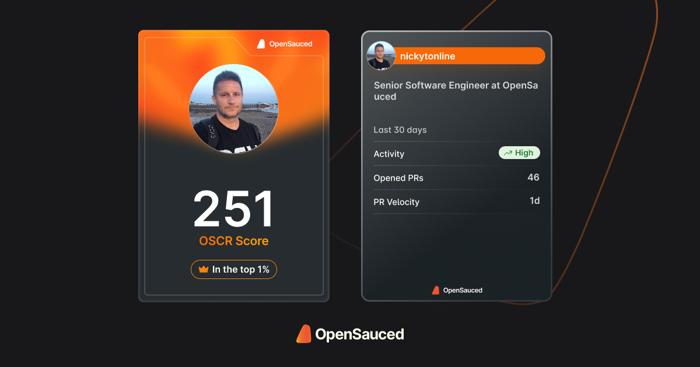

# <em>Hi!</em> I'm Nick. 👋🏻

Hello! My name is Nick Taylor. I'm a Senior Software Engineer at [OpenSauced](https://opensauced.pizza). I'm a fan of Open Source and have a growing interest in serverless and edge computing. I'm not a big fan of spiders, but I know they're doing good work eating bugs. I also [live stream](https://nickyt.live).

I am a <em>big</em> fan of TypeScript, JavaScript, Node, and all things frontend. Aside from programming, I enjoy contributing to open source, hitting the gym, snowboarding, and rugby a long time ago.

Check out my open source contribution snapshot! 👇

---

## Latest Blog Posts

<!-- BLOG-POST-LIST:START -->
- [Supercharge Your GitHub Profile: Showcase Your Open Source Contributions](https://www.nickyt.co/blog/showcase-your-open-source-contributions-with-opensauced-dev-cards-2j0k/)
- [Multitenant Database Schemas](https://www.nickyt.co/blog/multitenant-database-schemas-4ofc/)
- [Review: Fifine Ampligame AM6 Condenser Mic](https://www.nickyt.co/blog/review-fifine-ampligame-am6-condenser-mic-714/)
- [The React useRef Hook: Not Just for DOM Elements](https://www.nickyt.co/blog/the-react-useref-hook-not-just-for-html-elements-3cf3/)
- [Valibot: A New Approach to Data Validation in JavaScript](https://www.nickyt.co/blog/valibot-a-new-approach-to-data-validation-in-javascript-1mgb/)
- [The State of .NET Tooling in 2024](https://www.nickyt.co/blog/the-state-of-net-tooling-2024-169g/)
- [Tools that keep me productive](https://www.nickyt.co/blog/tools-that-keep-me-productive-1no5/)
- [Yet Another Newsletter: Saying goodbye](https://www.nickyt.co/blog/yet-another-newsletter-saying-goodbye-d99/)
<!-- BLOG-POST-LIST:END -->

## Latest Videos

<!-- VIDEO-LIST:START --><aside><kbd></kbd><kbd></kbd><kbd></kbd><kbd></kbd><kbd></kbd><kbd></kbd></aside><!-- VIDEO-LIST:END -->

Check out [more videos on my YouTube channel](https://www.youtube.com/channel/UCBLlEq0co24VFJIMEHNcPOQ)

## 

media:

- [OneTipAWeek.com](https://onetipaweek.com)
- [nickyt.live](https://nickyt.live)
- [Twitch](https://twitch.tv/nickytonline)
- [YouTube](https://nickyt.tube)
- [Podcast](https://pod.iamdeveloper.com)

socials:

- [X/Twitter](https://twitter.com/nickytonline)
- [Threads](https://www.threads.net/@nickytonline)
- [LinkedIn](https://www.linkedin.com/in/nickytonline)
- [Mastodon](https://toot.cafe/@nickytonline)

blogging:

- [nickyt.co](https://www.nickyt.co)
- [DEV](https://dev.to/nickytonline)
- [Hashnode](https://nickytonline.hashnode.dev)
